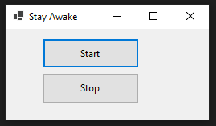

# StayAwake
I just made another solution for the lock screen problem in VBS. This script sends a NumLock key every 500 millisecond (0.5 second) to prevent the screen become switch into a lock screen mode. 
##

## Screenshot:

  

  

